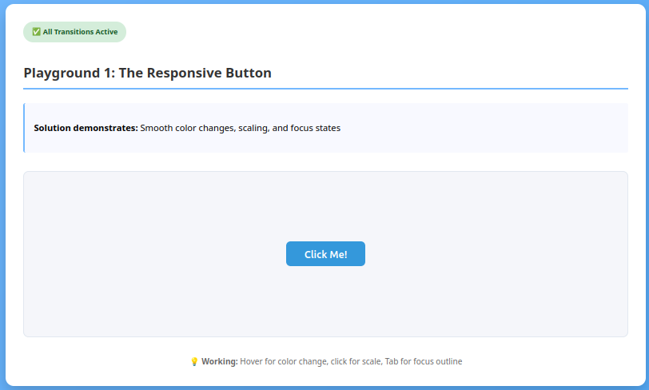
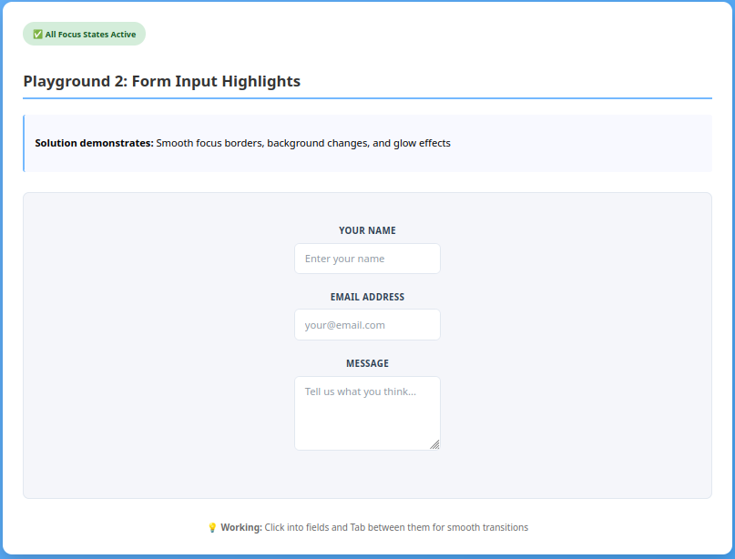
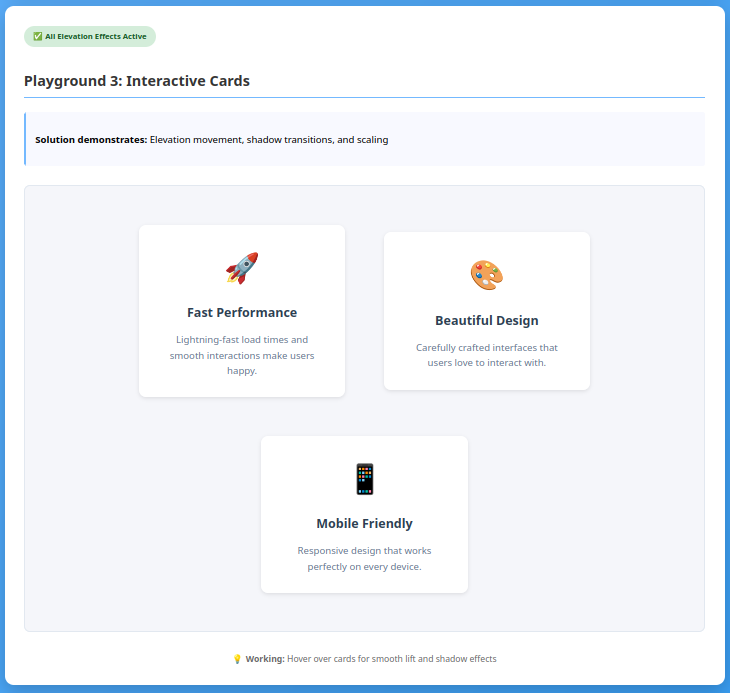
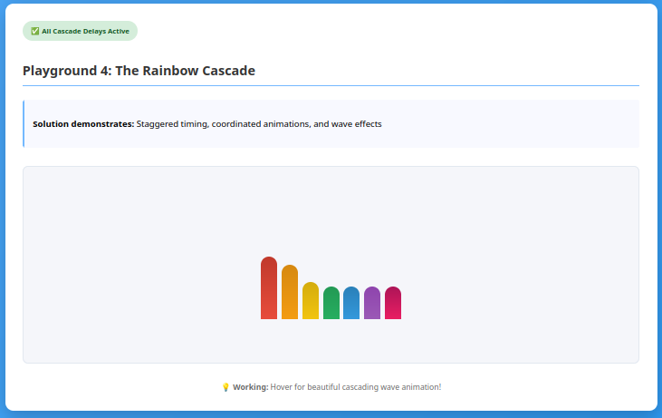
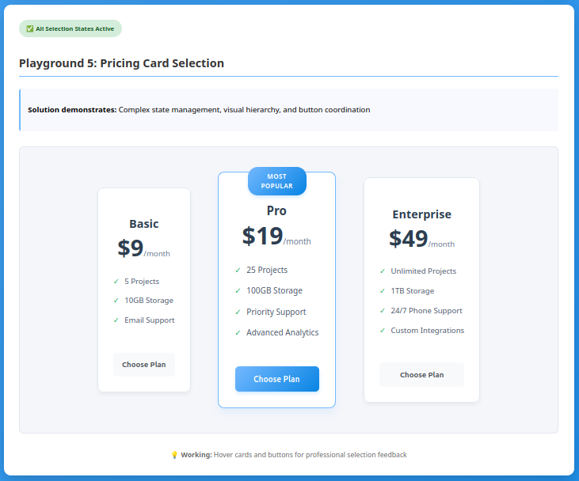
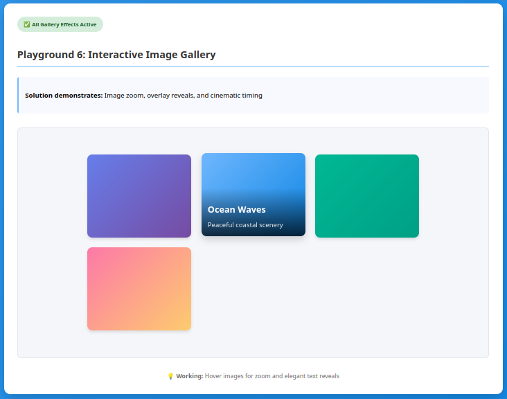
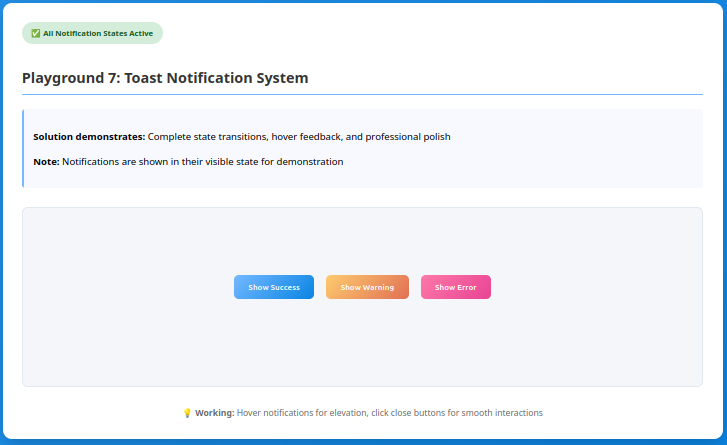

# Intro to CSS Transitions Lab

⚡ **Transform static interfaces into smooth, interactive experiences!**

Welcome to your journey into CSS transitions! In this lab, you'll discover how professional websites create those smooth, polished interactions that make users feel delighted rather than jarred by sudden changes.

By the end of this lab you'll have a good understanding of the transition property while also getting practice with state selectors, timing functions, and various CSS properties.

## 🚀 Getting Started

1. **Open the HTML file**: Start by opening `index.html` in your browser
2. **Work through playgrounds in order**: Each builds on the previous knowledge
3. **Read the CSS comments carefully**: They contain your learning path and tasks
4. **Experiment freely**: Try different values to see what happens!
5. **Test interactions**: Hover, click, focus - experience what you're building

## ⚡ The 7 Transition Playgrounds

### Playground 1: The Responsive Button 🔘

**Learning Focus**: CSS state selectors and basic transition syntax

- **File**: `css/playground-1-responsive-button.css`
- **Concepts**: `:hover`, `:active`, `:focus` states, `transition` property basics
- **Skills**: Understanding when and why to use different interaction states
- **Time**: ~25 minutes

_You'll transform a boring button into one that responds smoothly to every user interaction._



### Playground 2: Form Input Highlights 📝

**Learning Focus**: Focus states and accessibility-friendly design

- **File**: `css/playground-2-form-highlights.css`
- **Concepts**: `:focus` states, border transitions, user guidance
- **Skills**: Creating accessible form feedback and visual hierarchy
- **Time**: ~25 minutes

_Build form inputs that guide users with gentle, helpful visual cues._



### Playground 3: Interactive Cards 🃏

**Learning Focus**: Multi-property transitions and elevation effects

- **File**: `css/playground-3-card-effects.css`
- **Concepts**: `transform`, `box-shadow`, coordinated property changes
- **Skills**: Creating depth and dimension with smooth transitions
- **Time**: ~25 minutes

_Make content cards that feel alive and inviting when users interact with them._



### Playground 4: The Rainbow Cascade 🌈

**Learning Focus**: Transition delays and coordinated timing

- **File**: `css/playground-4-rainbow-cascade.css`
- **Concepts**: `transition-delay`, staggered animations, creative effects
- **Skills**: Creating complex, choreographed interaction sequences
- **Time**: ~30 minutes

_Build a rainbow that responds with a beautiful cascading wave effect - pure visual delight!_



### Playground 5: Pricing Card Selection 💳

**Learning Focus**: Complex state management and visual feedback

- **File**: `css/playground-5-pricing-selection.css`
- **Concepts**: Multiple states, visual hierarchy, selection feedback
- **Skills**: Professional UI patterns for e-commerce and SaaS interfaces
- **Time**: ~30 minutes

_Create a pricing section that helps users make confident purchasing decisions._


  
### Playground 6: Interactive Image Gallery 🖼️

**Learning Focus**: Advanced transforms and performance considerations

- **File**: `css/playground-6-image-gallery.css`
- **Concepts**: `transform: scale()`, overlay effects, smooth reveals
- **Skills**: Image interactions and progressive disclosure patterns
- **Time**: ~30 minutes

_Build a photo gallery with professional zoom and reveal effects._



### Playground 7: Toast Notification System 🍞

**Learning Focus**: Professional interaction patterns and complex state transitions

- **File**: `css/playground-7-toast-notifications.css`
- **Concepts**: Entrance/exit animations, state machines, professional polish
- **Skills**: Complete interaction systems and user experience design
- **Time**: ~35 minutes

_Design a notification system that feels as smooth as the apps users love._



## 📝 How Each Playground Works

### Stage 1 Playgrounds (1-2): **Guided Discovery**

- Detailed explanatory comments teach you the "why" behind concepts
- Step-by-step instructions with specific tasks
- Strong focus on understanding state selectors and transition basics

### Stage 2 Playgrounds (3-4): **Problem-Solving with Context**

- Real-world problems for you to solve with guided hints
- Exploration of multiple CSS properties through transitions
- Creative challenges that build confidence

### Stage 3 Playgrounds (5-7): **Creative Architecture**

- Professional scenarios where you design the complete interaction
- Multiple approaches to choose from
- Real-world complexity with scaffolding support

## 🔧 Getting Unstuck

### If your transition isn't working:

1. **Check the transition placement**: Goes on the base element, not the `:hover` state
2. **Verify the property name**: `background-color` not `background`, `transform` not `translate`
3. **Check syntax**: Semicolons at the end, proper spelling
4. **Test the trigger**: Are you hovering/clicking/focusing the right element?

### If something looks wrong:

1. **Refresh the browser** after saving CSS changes
2. **Check the browser console**: Right-click → Inspect → Console for errors
3. **Read comments twice**: The details matter for understanding
4. **Try the suggested values first** before experimenting

### If you're confused:

1. **Read the explanation sections** - they contain key insights
2. **Experiment with individual properties** to understand their effects
3. **Compare with and without transitions** to see the difference

## 📚 Key Concepts You'll Master

### Transition Syntax

```css
.element {
  /* Basic syntax */
  transition: property duration timing-function delay;

  /* Examples */
  transition: all 0.3s ease;
  transition: background-color 0.2s ease-out;
  transition: transform 0.4s ease-in-out 0.1s;
}
```

### State Selectors

```css
.button {
  /* normal state */
}
.button:hover {
  /* mouse over */
}
.button:active {
  /* being clicked */
}
.button:focus {
  /* keyboard focused */
}
```

### Timing Functions

- `ease` - slow start, fast middle, slow end (most natural)
- `ease-in` - slow start, builds speed
- `ease-out` - fast start, slows down
- `ease-in-out` - slow start and end
- `linear` - constant speed throughout

### Transform Functions

- `translateX(20px)` - move horizontally
- `translateY(-10px)` - move vertically
- `scale(1.1)` - make larger/smaller
- `rotate(5deg)` - rotate around center

**Time Estimate**: 3 hours total (including experimentation and breaks)  
**Difficulty**: Beginner-friendly with guided progression to intermediate concepts  
**Prerequisites**: Basic CSS knowledge (selectors, properties, values)

**Remember**: Every professional web developer started exactly where you are now. These transitions will become second nature with practice - enjoy the journey of making the web more delightful! ⚡
